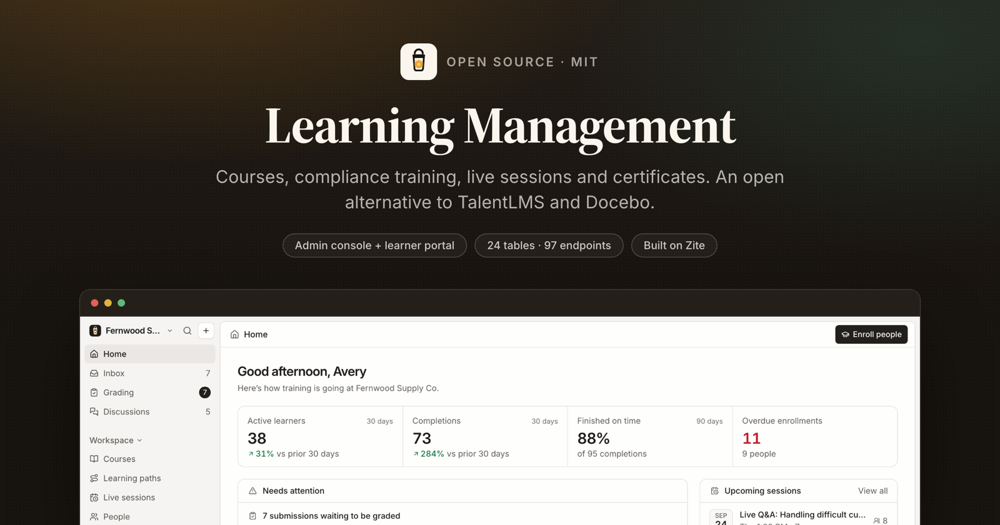
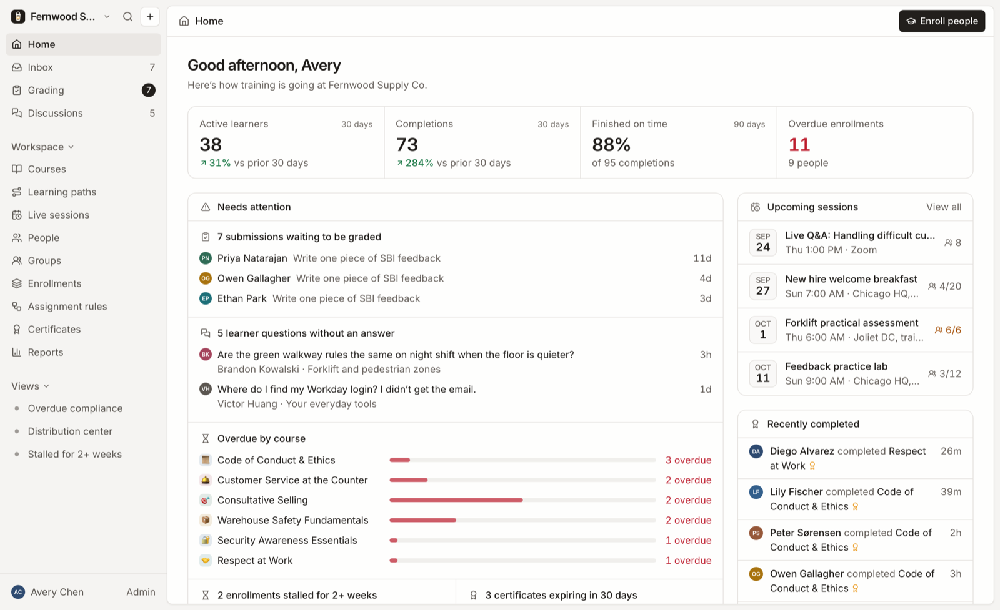
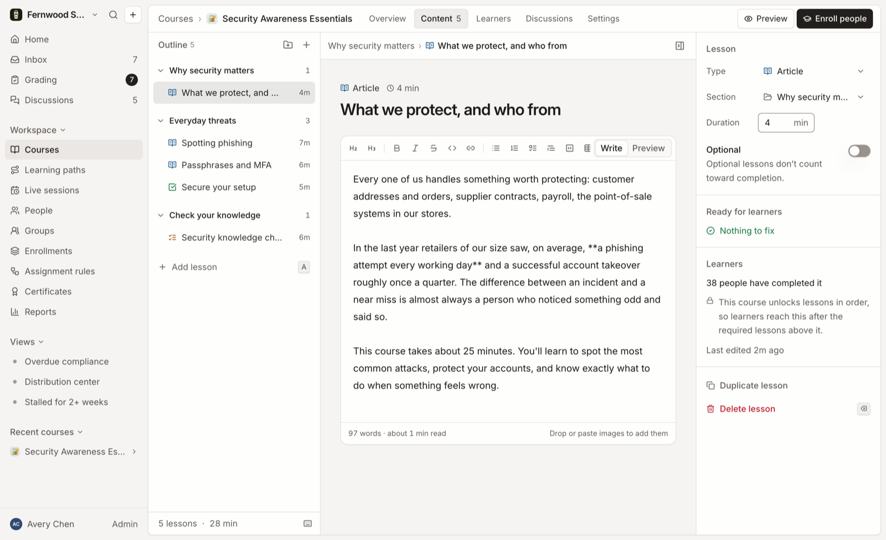
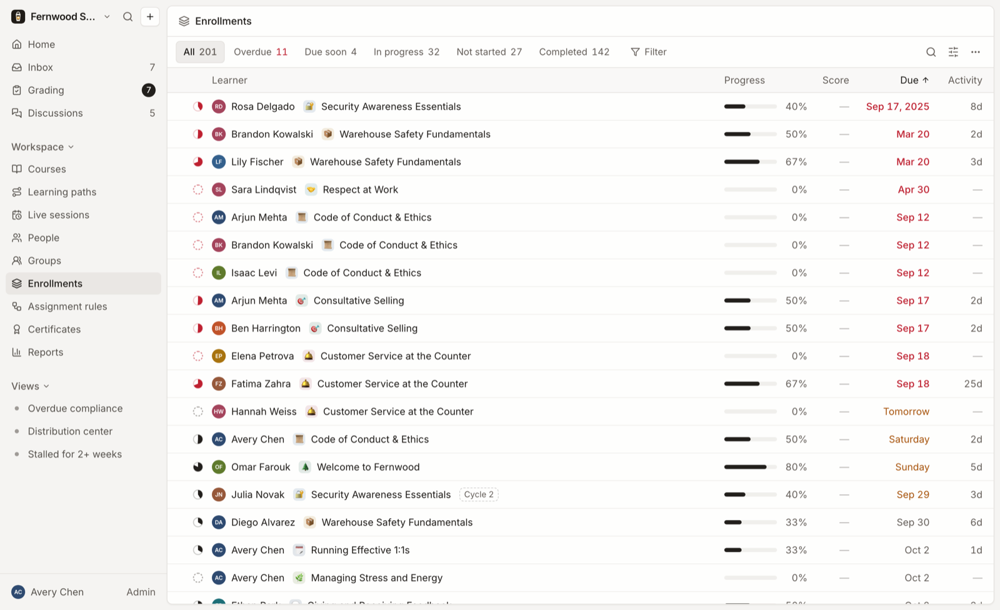
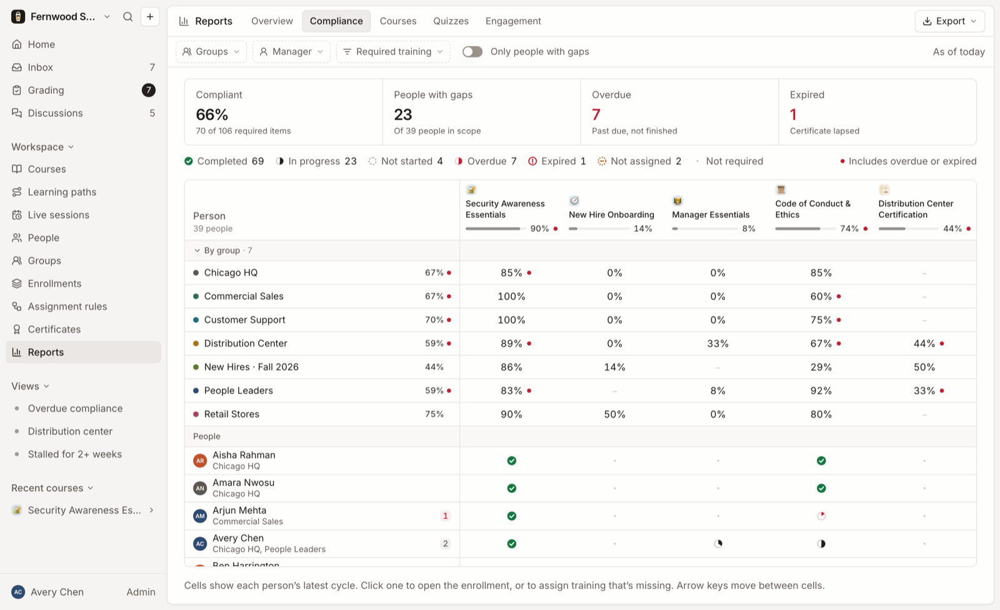
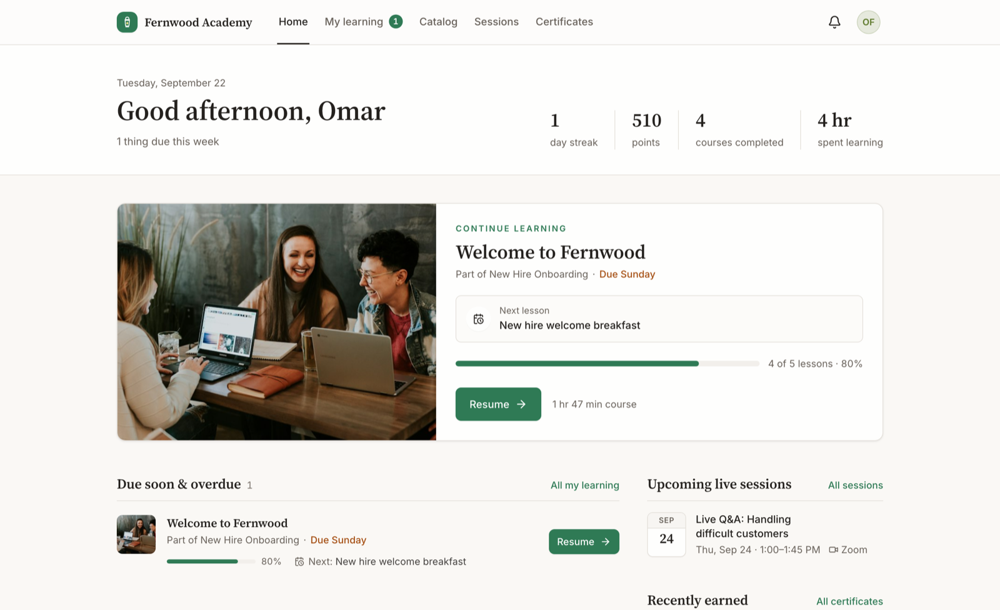
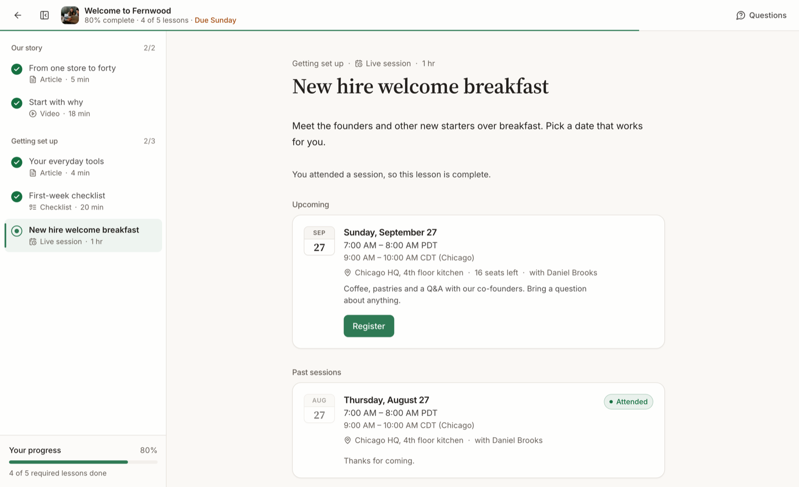

<p align="center">
  
</p>

<h3 align="center">Learning Management</h3>

<p align="center">
  Open-source learning management: courses, compliance training, live sessions
  and certificates.
  <br/>
  An open alternative to <b>TalentLMS</b>, <b>Docebo</b> and <b>360Learning</b>.
</p>

<p align="center">
  <a href="#whats-in-it">Features</a> ·
  <a href="#install-it-in-your-own-workspace">Install</a> ·
  <a href="#how-it-works">How it works</a> ·
  <a href="#local-development">Development</a> ·
  <a href="https://developers.zite.com">Zite docs</a>
</p>

<p align="center">
  <a href="LICENSE"></a>
  <a href="https://github.com/zite/learning-management/stargazers"></a>
  <a href="https://www.npmjs.com/package/zitejs"></a>
</p>

---

## What this is

Training for a whole organization: build courses, assign them by rule, track
compliance, run live sessions and issue certificates.

This is a **Zite solution**, meaning a workspace you install into your own
[Zite](https://zite.com) account and then edit. Zite provides the Postgres
database, the endpoint runtime, auth and hosting. Everything above that is the
~76,000 lines of TypeScript in this repository.

Two apps share one database:

| App | Directory | Who uses it | Access |
| --- | --- | --- | --- |
| **Learning Management** | `apps/learning-management` | Admins and instructors: build courses and paths, enroll people, grade, run sessions, report on compliance | Internal (organization members) |
| **Learner Portal** | `apps/learner-portal` | Learners and their managers: take courses, register for sessions, earn certificates, follow their team's progress | External (public, with sign-in) |

It opens on a populated demo: Fernwood Supply Co., with 39 people, 12 courses, 4
learning paths and a year of history, so every screen has something in it the
first time you look. Settings has a one-click way to delete all of it.

<p align="center">
  
</p>

---

## What's in it

### For admins and instructors

- **Home.** Active learners, completions and on-time rate against the previous
  period, plus everything that needs a person: submissions to grade, unanswered
  learner questions, overdue training by course, stalled learners and expiring
  certificates. Upcoming sessions and recent completions sit alongside.

- **Course builder.** Sections and eight lesson types: article (Markdown), video
  (YouTube, Vimeo, Loom, Wistia or an upload, with an optional watch requirement on
  sources that report progress), quiz, assignment, file, embed, live session and
  checklist. Drag to reorder, lock lessons in order, mark lessons optional and preview
  as a learner. Quizzes have single, multiple, true/false and short-answer questions,
  a passing score, attempt limits, time limits, shuffling and a rule for revealing
  answers. AI can draft a whole course outline or a quiz from the lessons.

  

- **Courses and learning paths.** Status (draft, published, archived), category,
  level, owner and instructors, visibility (catalog or assigned only), due-date
  defaults, certificates with a validity period, and a per-course overview: funnel,
  enrollments over time, lesson drop-off, quiz scores, ratings and time spent. Paths
  chain courses, optionally in sequence, with their own due date and certificate.

- **Enrollments.** One keyboard-first list behind every "who is doing what" view
  (J/K, X to select, Space to peek): filter by status, due state, due date, course,
  category, group, how people were enrolled, when they enrolled or finished,
  inactivity, quiz score and recertification cycle; group and order; save personal or
  shared views to the sidebar. Bulk set due dates, remind, withdraw, restore, reset
  or mark complete, and export to CSV.

  

- **People and groups.** Directory with roles (Admin, Instructor, Learner),
  managers, job titles and groups (departments, teams, locations, cohorts); CSV
  import; each person's transcript, certificates, sessions and activity.

- **Assignment rules.** Enroll everyone, or chosen groups, in a course or path with a
  due date, including people who join later, and optionally repeat it every N
  months as recertification. Preview who a rule reaches before running it.

- **Grading, inbox and discussions.** A grading queue with rubric, grade and feedback
  (AI can draft feedback from the submission), notifications for staff, and lesson
  discussions where instructors answer learner questions.

- **Live sessions.** Schedule in any time zone, with capacity and automatic
  waitlists, meeting links, recordings and attendance that completes the linked lesson.
  Cancel with a note to registrants, then reschedule and register the same people
  again, or duplicate any session.

- **Certificates.** Every certificate issued, expiring or expired; revoke and
  restore; printable certificate PDFs and a public verification page per credential.

- **Reports.** Overview (active learners, enrollments, completions, completion and
  on-time rates, overdue, quiz scores, learning hours, certificates) over 30 days, 90
  days, 12 months or a custom range with comparisons; a compliance matrix of people
  × required training; course, quiz (per-question difficulty) and engagement reports.
  Filter by group, category and course, and export six CSVs.

  

- **Settings.** Organization and logo, the learner academy (name, headline, brand
  colour, who can sign in, and whether self-enrollment, discussions and the
  leaderboard are on), categories, reminder timing, eleven email templates with merge
  tags and test sends, certificate title and signatory, your profile, and removing the
  demo data.

- **Daily reminders.** A scheduled job (14:00 UTC) sends due-date and overdue
  reminders, a weekly digest to managers of overdue reports, certificate-expiry
  warnings and session reminders, each at most once per window, and opens
  recertification cycles when certificates near expiry.

- **Everywhere:** ⌘K command menu, global search, `?` for every shortcut, light and
  dark themes and a layout that works down to phones.

### For learners and managers

<p align="center">
  
</p>

- A home page that resumes where they left off, with what's due, streak, points and
  upcoming sessions.
- **My learning**, **catalog** (self-enroll where allowed), **learning paths** and
  **certificates** they can download, add to LinkedIn and have verified.
- A focused player for every lesson type: quiz attempts with timers and review,
  assignment submissions with files, checklists, video progress, session registration,
  lesson discussions and an AI study assistant that answers only from the lesson.
- **Team** for managers: each direct report's open, overdue and completed training,
  with a one-tap reminder (at most once a day per enrollment).
- Sessions, notifications, a leaderboard and profile.

<p align="center">
  
</p>

---

## Install it in your own workspace

Zite apps are built by pointing a coding agent at the platform over MCP, and
installing one works the same way.

**1. Connect the Zite MCP server to your agent.**

```bash
claude mcp add --transport http zite https://mcp.zite.com/mcp
```

(Cursor, VS Code and any other MCP client work the same way. See
[the Zite quickstart](https://developers.zite.com/quickstart).)

**2. Give it this prompt.**

> Install https://github.com/zite/learning-management into a new Zite workspace.
>
> 1. `create_workspace` named "Learning Management", then `create_sandbox` on it.
> 2. In the sandbox, add this repo as a git remote and check its files out over
>    `/workspace`, keeping the sandbox's own `zite.config.json`.
> 3. Read `zite.schema.json` and create all 24 tables with `create_table`, passing
>    each field's `definition` (`name`, `type`, `template`) straight through. Do this
>    **before** `create_app`, because `create_app` and `check_app` refresh
>    `zite.schema.json` from the live database, and would otherwise blank it.
> 4. `create_app` "Learning Management" (internal) and "Learner Portal" (external).
>    Use those names exactly: the directory is derived from the name, and these two
>    produce `apps/learning-management` and `apps/learner-portal`, which is what this
>    repo already uses.
> 5. Run `yarn install`, so the workspace packages are linked and `@project/shared`
>    resolves.
> 6. `check_app` both apps, `commit`, then `publish_app` both.

**3. Open the admin app.** It seeds the demo on first load. When you are ready for
real data, go to **Settings → Data → Remove demo data**, which deletes everything the
seed created and keeps anything you have added since.

<details>
<summary>Setting it up for your own organization</summary>

1. **Publish both apps.** The admin app is internal; the Learner Portal is external
   with sign-in. Open the Learner Portal once so links in emails point at it.
2. **Make it yours.** Organization name and logo under General; academy name, brand
   colour and sign-in policy (invited only, allowed email domains, or anyone) under
   Academy; categories; then invite people or import a CSV under People.
3. **Assign training.** Create assignment rules for required courses so new people
   are enrolled automatically, with recertification where it applies.
4. **Email.** Messages go out through Zite's email integration. Review each template
   under Settings → Notifications and send yourself a test.
5. **AI (optional).** Connect Anthropic to the workspace (`ZITE_ANTHROPIC_ACCESS_TOKEN`)
   to turn on course and quiz drafting, feedback drafts and the study assistant.
   Without it those controls don't appear and everything else works.
6. **Reminders** run on their own once the admin app is published.

</details>

---

## How it works

A Zite workspace is **one database with one or more apps on top of it**. The split
that matters:

| Part | Where it runs |
| --- | --- |
| `apps/*/src/` minus `api/` | The browser. A normal Vite + React SPA. |
| `apps/*/src/api/*.ts` | Zite's endpoint runtime, server-side. One file = one endpoint. |
| `packages/*` | Imported by both. No build step; consumed as TypeScript source. |
| `.zite/` | Generated clients: typed DB access and a typed caller. Never edited by hand. |

The frontend never touches the database. It calls endpoints through a generated typed
client (`import { getHome } from 'zitejs/api'`), and endpoints reach the database
through another (`import { zite } from 'zitejs/db'`). 97 endpoints: 65 admin and
32 learner.

```
learning-management/
├── apps/
│   ├── learning-management/   the admin console  (internal)
│   │   ├── src/api/           65 endpoints
│   │   ├── src/pages/         19 pages
│   │   ├── src/seed/          the Fernwood demo
│   │   └── src/server/        reports, reminders, AI, demo removal
│   └── learner-portal/        the learner app    (external)
│       ├── src/api/           32 endpoints
│       └── src/pages/         14 pages
├── packages/
│   ├── shared/                the domain core, imported by BOTH apps
│   │   ├── progress.ts        statuses, due states, points
│   │   ├── lessons.ts         the 8 lesson types, quiz grading
│   │   └── server/enroll.ts   the progress engine
│   └── components/            shadcn/ui, vendored
└── zite.schema.json           24 tables, the database as a file
```

### The data model

24 tables. `Enrollments` is the centre: one person's progress through one course,
in one recertification cycle.

```
Categories ──< Courses ──< Sections ──< Lessons
                  │                        └──< LessonProgress >── Enrollments
Paths ──< PathCourses >── Courses          ├──< QuizAttempts
  └──< PathEnrollments ──< Enrollments     ├──< Submissions
People ──< GroupMembers >── Groups         └──< Comments
  ├──< Enrollments ──> Certificates
  └──< Registrations >── Sessions
AssignmentRules · Notifications · Activity · EmailTemplates · Views · Settings
```

### Decisions worth knowing before extending it

**Progress is derived, completion is final.** An enrollment's progress, status and
due state are recomputed from `LessonProgress` by one engine
(`packages/shared/server/enroll.ts`) that every write path calls: the player,
grading, attendance and bulk actions. Once an enrollment completes it stays complete;
editing the course afterwards doesn't reopen it.

**Recertification is a new cycle, not a reset.** A rule that repeats every N months
opens a new enrollment (`cycle` 2, 3…) before the certificate expires. Lists and
reports read the latest cycle unless asked for all of them, so history survives.

**Due states are computed, never stored.** Overdue, due soon and on track come from
the due date and status at read time (`dueState()` in `packages/shared/progress.ts`),
so nothing goes stale overnight.

**Lesson settings and answers are JSON.** Each lesson type's settings are parsed by
`packages/shared/lessons.ts`, which also grades quizzes and strips answers before
anything reaches a learner. **The server re-validates everything**, because Zite
does not enforce an endpoint's `inputSchema`.

**Both apps share `packages/shared`.** The progress engine, grading, brand colour
maths, certificate artwork, lesson media and server helpers are imported by both
apps' frontends and endpoints. Don't import `zod` there: the root `node_modules` has
zod 4 while endpoints use the app's zod 3.

**Foreign keys are text columns.** Every list is a filtered, sorted SQL query. Joins
cast the uuid side (`c.id::text = e."courseId"`), unset text is `''` (never `NULL`),
and anything that can exceed `zite.sql`'s 2,000-row cap pages by id.

**Bursts of writes are throttled.** The live database rejects many concurrent writes,
so bulk work goes through `eachWrite` (two at a time) and `withRetry` in
`packages/shared/server/sql.ts`.

**The actor always comes from the session.** Admin endpoints call `getActor` and
learner endpoints call `getLearner`; no endpoint trusts an id it's handed for who is
acting, and a manager can only see and nudge their own reports.

---

## Local development

```bash
yarn install
cp .env.example .env.local    # then put your own workspace id in it
yarn dev                      # admin console on :8080
yarn dev:learner-portal       # learner portal on :8081
```

**What works offline:** the whole frontend, `tsc`, and `vite build`. Editing a
component hot-reloads.

**What does not:** the endpoints in `src/api/` execute on Zite's runtime against your
workspace database, not on your machine. `yarn dev` serves the UI, but every endpoint
call goes out to the workspace named in `.env.local` and needs a session for that
organization. There is no local database mode yet.

Run `yarn generate` after adding, renaming or deleting an endpoint. It regenerates
`.zite/` so `zitejs/api` sees the new name.

```bash
yarn run check    # tsc + endpoint bundling + vite build, both apps
```

> **Note.** On an app this size `zitejs check` prints `bundle endpoints ✗` with no
> error and exits non-zero. That is a 1 MB stdout buffer in the checker, not a real
> failure. The `tsc` and `vite build` lines above it are trustworthy. To see genuine
> endpoint errors, bundle to a file instead:
> `npx zitejs bundle --app learning-management > /tmp/b.json` and read `endpointErrors`.

---

## Tech stack

React 18 · TypeScript · Vite · Tailwind CSS 3 · [shadcn/ui](https://ui.shadcn.com) ·
Radix · TanStack Query & Table · Recharts · TipTap · dnd-kit · date-fns · zod ·
[zitejs](https://github.com/zite/zitejs) (database, endpoints, auth, email, PDF,
uploads, schedules) · [Claude](https://www.anthropic.com) for the optional AI features.

## Contributing

Issues and pull requests are welcome. See [CONTRIBUTING.md](CONTRIBUTING.md) for how
to get a workspace to develop against and what we look for in a change. Bugs and
feature ideas go in [Issues](https://github.com/zite/learning-management/issues);
anything security-related goes to [SECURITY.md](SECURITY.md) instead.

## License

MIT. See [LICENSE](LICENSE). Third-party notices in [NOTICE](NOTICE).
